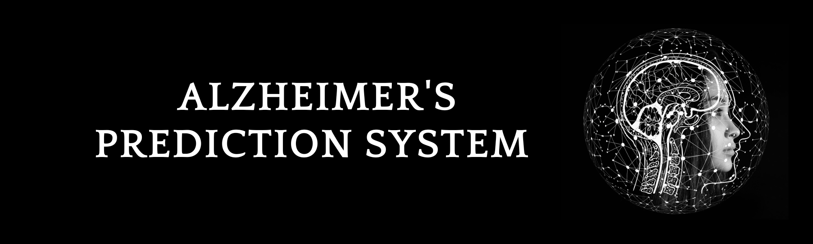

# Alzheimer's Disease Prediction


## Table of Contents
- [Introduction](##introduction)
- [Setup Instructions](#setup-instructions)
  - [Prerequisites](#prerequisites)
- [Usage Guide](#usage-guide)
  - [Data Input](#data-input)
- [Additional Information](#additional-information)
  - [Model Details](#model-details)
  - [Dataset](#dataset)

## Introduction
Alzheimer's disease is a complex neurodegenerative disorder that affects millions of people worldwide. Early detection and prediction of Alzheimer's can lead to better management and treatment outcomes. This prediction system utilizes a machine learning model trained on a dataset of relevant features to provide predictions about the likelihood of Alzheimer's disease.

### About Alzheimer's Disease
Alzheimer's disease (AD) is a progressive neurodegenerative disease. Though best known for its role in declining memory function, symptoms also include: difficulty thinking and reasoning, making judgements and decisions, and planning and performing familiar tasks. It may also cause alterations in personality and behavior. The cause of AD is not well understood. There is thought to be a significant hereditary component. For example, a variation of the APOE gene, APOE e4, increases risk of Alzheimer's disease.

### Purpose of the project
The purpose of this project proposal is to develop a machine learning model for the early prediction of Alzheimer's disease. Alzheimer's disease is a devastating neurodegenerative disorder that affects millions of individuals worldwide. Early detection is crucial for better patient care and the development of potential interventions. This project aims to leverage machine learning techniques to create a predictive model that can identify individuals at risk of Alzheimer's disease based on relevant data.

### Potential Impact
The potential impact of this project on the issue of Alzheimer's disease is significant:
- Early prediction of Alzheimer's disease can lead to timely interventions, potentially slowing down the progression of the disease.
- Accurate prediction models can aid in identifying suitable candidates for clinical trials and research studies.
- Providing a tool for early prediction can raise awareness about Alzheimer's disease and encourage individuals to seek early medical evaluation.

## Setup Instructions
(Ignore if you do not want to run the application locally)

### Prerequisites
Before you begin, ensure you have the following:

- Python (>= 3.6)
- pip (Python package installer)

### Installation 
1. Clone the repository:

   ```bash
   git clone https://github.com/arpy8/Alzheimers_Prediction_System.git
   cd Alzheimers_Prediction_System
   ```

2. Create a virtual environment (recommended):

   ```bash
   python3 -m venv venv
   source venv/bin/activate  # On Windows: venv\Scripts\activate
   ```

3. Install the required packages:

   ```bash
   pip install -r requirements.txt
   ```

## Usage Guide

### Data Input

1. Go to the [web application](https://alzheimers-prediction.streamlit.app) and navigate to the prediction section from the sidebar.
2. Enter the patient's data as asked.
3. The prediction system will process the given user data and provide predictions for Alzheimer's likelihood.

## Additional Information

### Model Details
- **Algorithm**: Logistic Regression (Accuracy≈70%)
- **Purpose**: Binary classification for Alzheimer's prediction
- **Input Features**: Features relevant to Alzheimer's risk, such as age, mmse score, adoe allele type, adoe4 type and more.

### Dataset
The model was trained on a dataset collected from [Alzheimer’s Disease Neuroimaging Initiative (ADNI) ](https://adni.loni.usc.edu).
This dataset is a comprehensive collection of clinical, imaging, and genetic data from individuals with Alzheimer's disease.


### Deployment
Final model is deployed using streamlit at : https://alzheimers-prediction.streamlit.app

---

Aditya Khamitkar

github.com/TheNaiveSamosa


